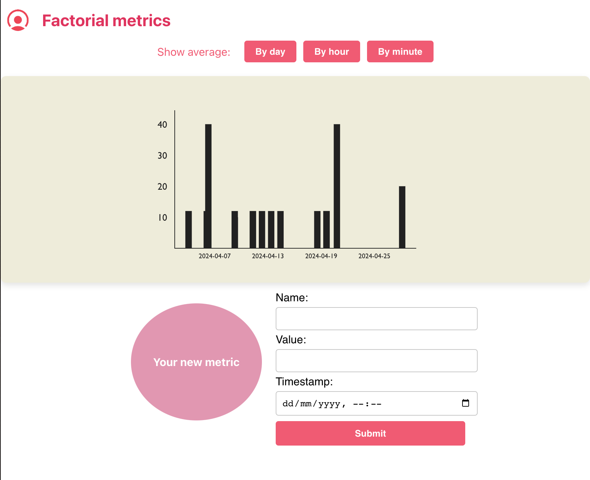

 

  <h3 align="center">Metric Visualization App</h3>
This repository contains the code for a metric visualization web application, consisting of a backend and frontend.
  

 

## Table Of Contents
- [About the Project](#about-the-project)
- [Built With](#built-with)
- [Getting Started](#getting-started)
- [Future version project](#Future-version-project)
- [Authors](#authors)

## About The Project

The metric visualization web application allows you to post and visualize metrics in a usable way. Each metric will have a timestamp, name, and value. The metrics will be shown in a timeline and you can choose to show averages per minute/hour/day 

## Built With
- Backend: Node.js, Express.js, PostgreSQL
- Frontend: React.js, Victory.js para la generación de gráficos
  
### Backend

The backend of the application is responsible for handling data storage and processing. It is structured as follows:

- Dockerfile: Dockerfile for building the backend Docker image.
- src/:
  - config/: Contains the database configuration (db.js).
  - controllers/: Controllers for handling metrics (metricController.js).
  - models/: Models for metrics (metricModel.js).
  - routes/: Routes for the metrics API (metricRoutes.js).
  - services/: Services for handling metrics logic (metricsService.js).
  - tests/ (Optional): Directory for tests, including example test files (metricController.test.js).
- app.js: Main entry point of the backend application.
- package.json: Node.js dependencies and scripts.
- .gitignore: List of files and directories to ignore in version control.

### Frontend

The frontend of the application is responsible for the user interface and data visualization. It is structured as follows:

- public/: Public files including index.html.
- src/:
  - components/: React components including Graph.js and MetricGenerator.js.
  - assets/: Assets such as images (logo.png).
  - styles/: CSS stylesheets including App.css.
- App.js: Main React component.
- index.js: Entry point for the React application.
- .gitignore: List of files and directories to ignore in version control.
- package.json: Node.js dependencies and scripts.
- package-lock.json: Lock file for Node.js dependencies.
- README.md: Markdown file with information about the repository.

## Getting Started

To run the application, follow these steps:

### Start the backend:

1. Navigate to the backend directory.
2. Build the Docker image: `docker build -t backend .`
3. Run the Docker container: `docker run -p 3001:3001 backend`

### Start the frontend:

1. Navigate to the frontend directory.
2. Install dependencies: `npm install`
3. Start the development server: `npm start`

The application should now be accessible at http://localhost:3000.

## Future version project

- Authentication
- Add test for every component

## Contributing

Contributions are what make the open source community such an amazing place to be learn, inspire, and create. Any contributions you make are **greatly appreciated**.

- If you have suggestions for adding or removing projects, feel free to [open an issue](https://github.com/Xueqi/ReadME-metric-visualization-app/issues/new) to discuss it, or directly create a pull request after you edit the _README.md_ file with necessary changes.
- Please make sure you check your spelling and grammar.
- Create individual PR for each suggestion.
- Please also read through the [Code Of Conduct](https://github.com/Xueqi/ReadME-metric-visualization-app/blob/main/CODE_OF_CONDUCT.md) before posting your first idea as well.

### Creating A Pull Request

1. Fork the Project
2. Create your Feature Branch (`git checkout -b feature/AmazingFeature`)
3. Commit your Changes (`git commit -m 'Add some AmazingFeature'`)
4. Push to the Branch (`git push origin feature/AmazingFeature`)
5. Open a Pull Request

## Authors

- **Xueqi Huang** - _FullstackDev_ - [Xueqi](https://github.com/hxueqi) -
